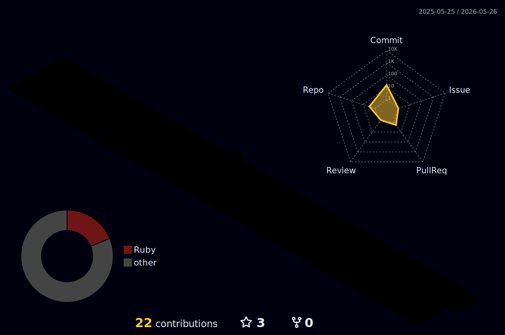

<picture>
  <source media="(prefers-color-scheme: dark)" srcset="https://readme-typing-svg.demolab.com/?lines=Hi+There!+I'm+ryukoeng;Welcome+to+my+GitHub!&font=Fira+Code&center=true&width=480&height=50&color=58a6ff&vCenter=true&pause=1000&size=22">
  <source media="(prefers-color-scheme: light)" srcset="https://readme-typing-svg.demolab.com/?lines=Hi+There!+I'm+ryukoeng;Welcome+to+my+GitHub!&font=Fira+Code&center=true&width=480&height=50&color=0969da&vCenter=true&pause=1000&size=22">
  
</picture>

<picture>
  <source media="(prefers-color-scheme: dark)" srcset="https://github-readme-stats.vercel.app/api?username=ryukoeng&show_icons=true&theme=tokyonight&hide_border=true&count_private=true">
  <source media="(prefers-color-scheme: light)" srcset="https://github-readme-stats.vercel.app/api?username=ryukoeng&show_icons=true&theme=default&hide_border=true&count_private=true">
  
</picture>

<picture>
  <source media="(prefers-color-scheme: dark)" srcset="https://github-readme-streak-stats.herokuapp.com/?user=ryukoeng&theme=tokyonight&hide_border=true">
  <source media="(prefers-color-scheme: light)" srcset="https://github-readme-streak-stats.herokuapp.com/?user=ryukoeng&theme=default&hide_border=true">
  
</picture>

<picture>
  <source media="(prefers-color-scheme: dark)" srcset="https://github-readme-activity-graph.vercel.app/graph?username=ryukoeng&theme=tokyo-night&hide_border=true">
  <source media="(prefers-color-scheme: light)" srcset="https://github-readme-activity-graph.vercel.app/graph?username=ryukoeng&theme=github&hide_border=true">
  
</picture>

  <picture>
    <source media="(prefers-color-scheme: dark)" srcset="./profile-3d-contrib/profile-night-rainbow.svg">
    <source media="(prefers-color-scheme: light)" srcset="./profile-3d-contrib/profile-season-animate.svg">
    
  </picture>

  

---

Auto-generated daily via <a href="https://github.com/ryukoeng/ryukoeng/actions">GitHub Actions</a>

· Powered by <strong>lowlighter/metrics</strong>, <strong>yoshi389111/github-profile-3d-contrib</strong>, <strong>github-readme-stats</strong> & <strong>readme-typing-svg</strong>

